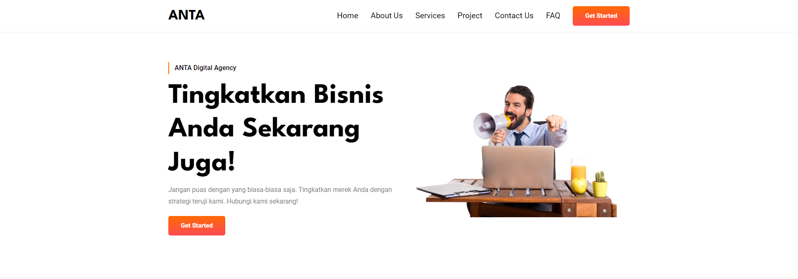
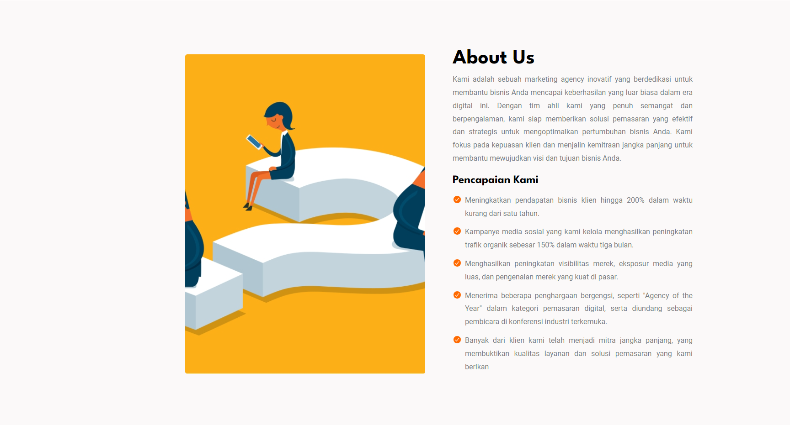
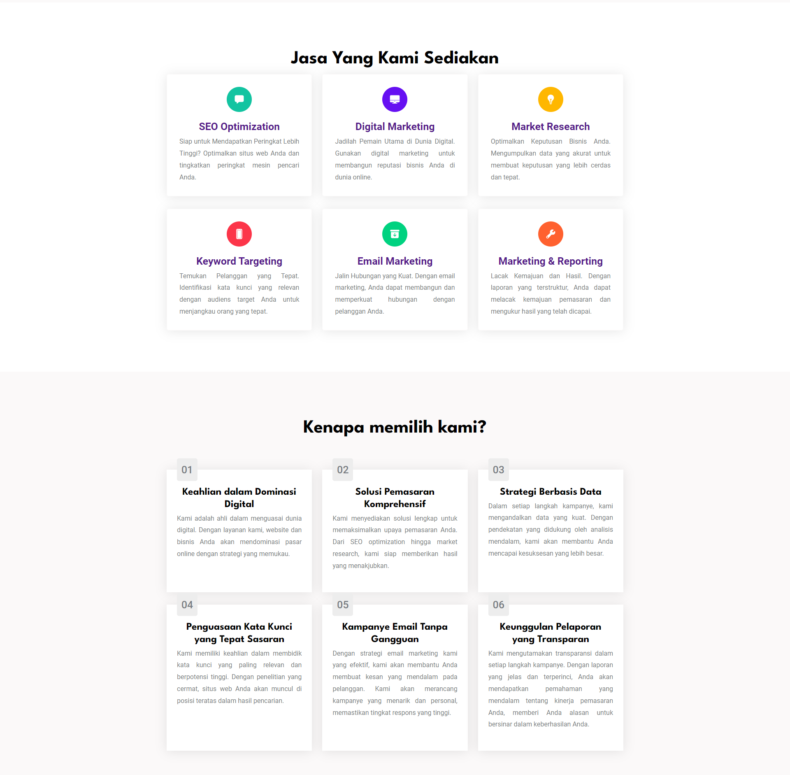
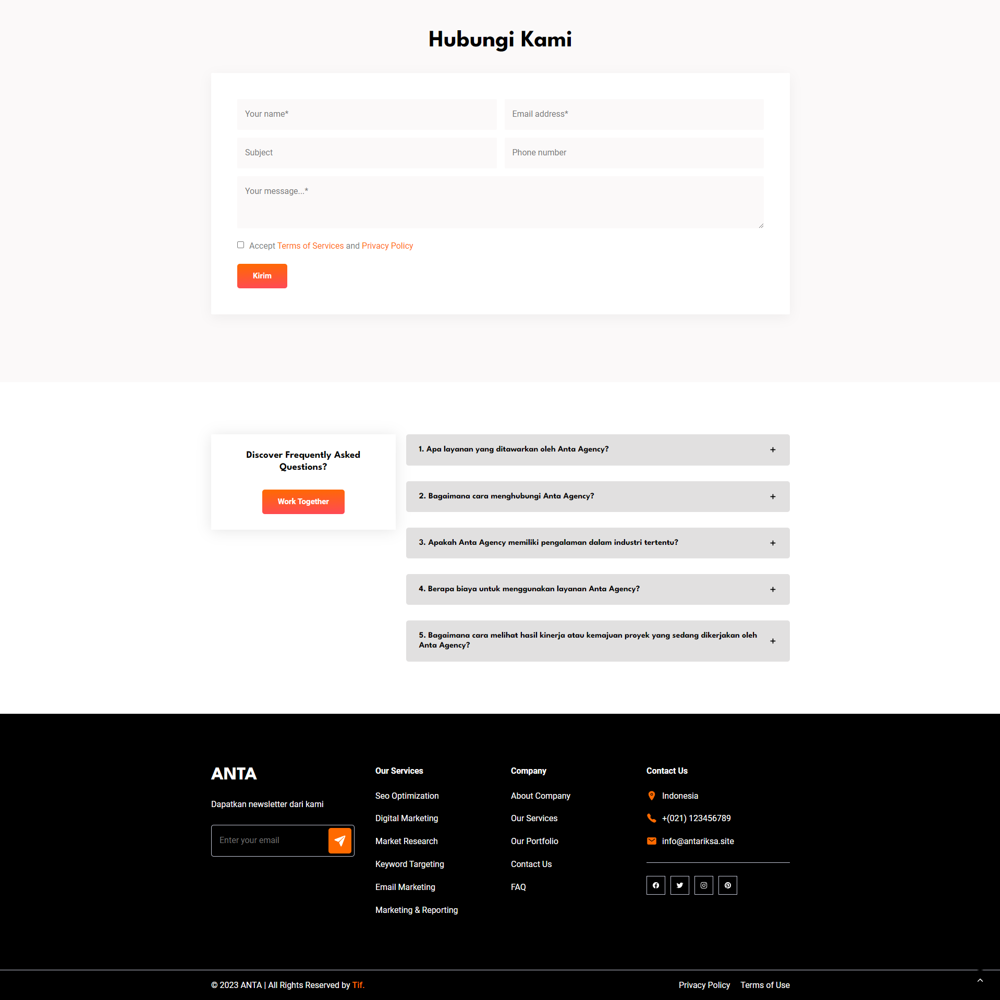

# Anta Digital Agency Website

## Introduction
This repository contains the source code for the website [antariksa.site](https://antariksa.site/). Anta Digital Agency is a digital agency that offers a range of services including website design and development, digital marketing, SEO optimization, social media management, and more. The website serves as a digital presence for the agency, providing information about their services, showcasing their projects, and facilitating communication with potential clients.

## Table of Contents
- [Introduction](#introduction)
- [Website Preview](#website-preview)
- [Features](#features)
- [Technologies Used](#technologies-used)
- [Installation](#installation)
- [How to Run the Website Locally](#how-to-run-the-website-locally)
- [Contributing](#contributing)
- [License](#license)
- [Development Team](development-team)
- [Development Process](development-process)
- [Deployment Process](deployment-process)


## Website Preview

<a href="https://antariksa.site/"> <strong> Live Preview</strong></a>

- Header


- About Section


- Service Section


- CTA and Project Section


- Contact, FAQ, and Footer


## Features
The website offers the following features:

1. Home: The home page provides an overview of Anta Digital Agency, highlighting its key offerings, values, and unique selling points.

2. About: The About page provides detailed information about Anta Digital Agency, including its history, mission, vision, and values.

3. Why Choose Us: This section emphasizes the unique advantages and benefits of working with Anta Digital Agency, showcasing their expertise, quality of work, and client satisfaction.

4. Services: The Services page outlines the range of services offered by Anta Digital Agency, providing detailed descriptions of each service.

5. Projects/Portfolio: The Projects or Portfolio section showcases the agency's previous work, including case studies, client testimonials, or examples of successful campaigns or designs.

6. Contact: The Contact page provides contact information for Anta Digital Agency, allowing visitors to reach out for inquiries, consultations, or quotes.

7. FAQ (Frequently Asked Questions): The FAQ section addresses common questions or concerns that potential clients may have, providing answers to help them make informed decisions.

## Technologies Used
The website is built using the following technologies:

- HTML
- CSS
- JavaScript

## How to Run the Website Locally
1. Make sure you have [Git](https://git-scm.com/) installed on your computer.
2. Open a terminal or command prompt.
3. Run the following command to clone the repository:

   ```bash
   git clone https://github.com/your_username/antariksa-website.git
   ```

   Replace `your_username` with your GitHub username.

4. Once the cloning is complete, navigate to the project folder:

   ```bash
   cd antariksa-website
   ```

5. Open the `index.html` file using a web browser.


## Contributing
If you would like to contribute to the development of the Antariksa Website, you can follow these steps:

1. Fork this repository.
2. Create a new branch:

   ```bash
   git checkout -b new-feature
   ```

3. Make the desired changes to the code.
4. Commit your changes:

   ```bash
   git commit -m "Add new feature"
   ```

5. Push to the newly created branch:

   ```bash
   git push origin new-feature
   ```

6. Create a Pull Request in this repository.

## License
Specify the license you have chosen for this project. Example: This project is licensed under the MIT License. See the [LICENSE](LICENSE) file for more information

## Development Team
- Developer Name - [GitHub Username](https://github.com/m-istighfar)
For any questions or feedback, please contact the development team via [email](mailto:istighfar.amal@gmail.com).

## Development Process

1. Make a HTML Structure

```html
<!DOCTYPE html>
<html>
  <head>
    <!-- Metadata, title, and external resource links -->
  </head>
  <body>
    <header>
      <!-- Logo, navigation menu, etc. -->
    </header>

    <section id="home">
      <!-- Home section content -->
    </section>

    <section id="about">
      <!-- About section content -->
    </section>

    <section id="services">
      <!-- Services section content -->
    </section>

    <section id="features">
      <!-- Features section content -->
    </section>

    <section id="project">
      <!-- Project section content -->
    </section>

    <section id="contact">
      <!-- Contact section content -->
    </section>

    <section id="faq">
      <!-- FAQ section content -->
    </section>

    <footer>
      <!-- Footer content -->
    </footer>
  </body>
</html>
```

Visit the link to see the finished html structure
<a href="index.html"> <strong> Complete HTML</strong></a>

2. Make a CSS Styling

```css
/* Home Section */
#home {
  /* Styles for the home section */
}

/* About Section */
#about {
  /* Styles for the about section */
}

/* Services Section */
#services {
  /* Styles for the services section */
}

/* Features Section */
#features {
  /* Styles for the features section */
}

/* Project Section */
#project {
  /* Styles for the project section */
}

/* Contact Section */
#contact {
  /* Styles for the contact section */
}

/* FAQ Section */
#faq {
  /* Styles for the FAQ section */
}

/* Footer Section */
footer {
  /* Styles for the footer section */
}
```

Visit the link to see the finished CSS Styling

<a href="./assets/css/style.css"> <strong> Complete CSS</strong></a>

3. Make a CSS Responsive

```css
/* Default styles for all screen sizes */

/* Styles for screen width >= 575px */
@media (min-width: 575px) {
  /* Additional styles for screens wider than 575px */
}

/* Styles for screen width >= 768px */
@media (min-width: 768px) {
  /* Additional styles for screens wider than 768px */
}

/* Styles for screen width >= 992px */
@media (min-width: 992px) {
  /* Additional styles for screens wider than 992px */
}

/* Styles for screen width >= 1200px */
@media (min-width: 1200px) {
  /* Additional styles for screens wider than 1200px */
}
```

Visit the link to see the finished CSS Responsive

<a href="./assets/css/style.css"> <strong> Complete CSS</strong></a>

4. Making a Javascript Code

On this website
JavaScript code is made with several goals, such as:

a. Make the navbar appear and disappear
b. Make sections on the FAQ appear and disappear
c. Create back to top feature

Visit the link to see the finished Javascript Code.

<a href="./assets/js/script.js"> <strong> Complete JS Code</strong></a>

## Deployment Process

- Step 1: Create a Repository on GitHub

1. Sign in your GitHub account.
2. Create a new repository to host website's source code.
3. Push website's source code to the GitHub repository.

- Step 2: Connect GitHub Repository to Netlify

1. Sign in to Netlify account
2. On the Netlify dashboard, click on "New site from Git" or "New site" button
3. Select Git provider (GitHub) and authorize Netlify to access repositories.
4. Choose the GitHub repository
5. Configure the build settings, including the build command and output directory.
6. Optionally, set up custom domain and SSL certificate settings.
7. Trigger the initial deployment by clicking on "Deploy site" or let Netlify automatically build and deploy website based on changes to the repository.

- Step 3: Set Up DNS Configuration in Cloudflare

1. Sign in to Cloudflare account
2. Add domain to Cloudflare by following the instructions provided.
3. Update domain's DNS settings to point to Netlify's servers. This usually involves adding DNS records such as `CNAME` with Netlify's provided values.
4. Configure any additional settings require in Cloudflare, such as SSL/TLS options, caching, or security settings.
5. Finish, Your website already live.
